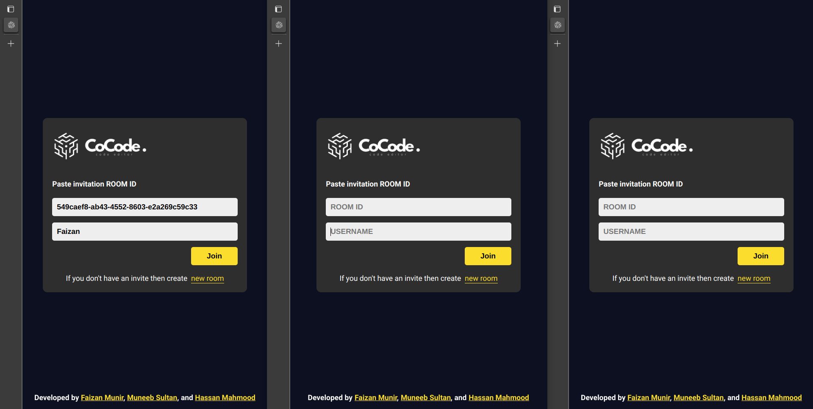
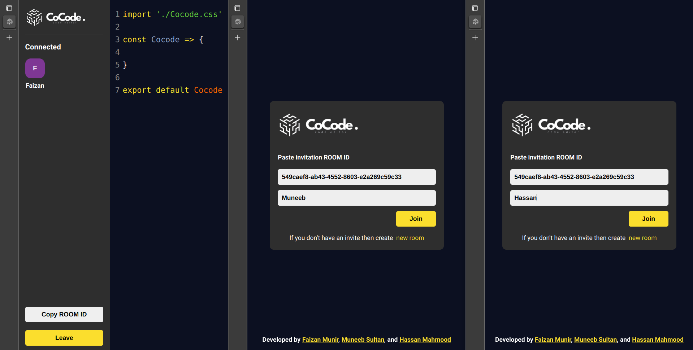
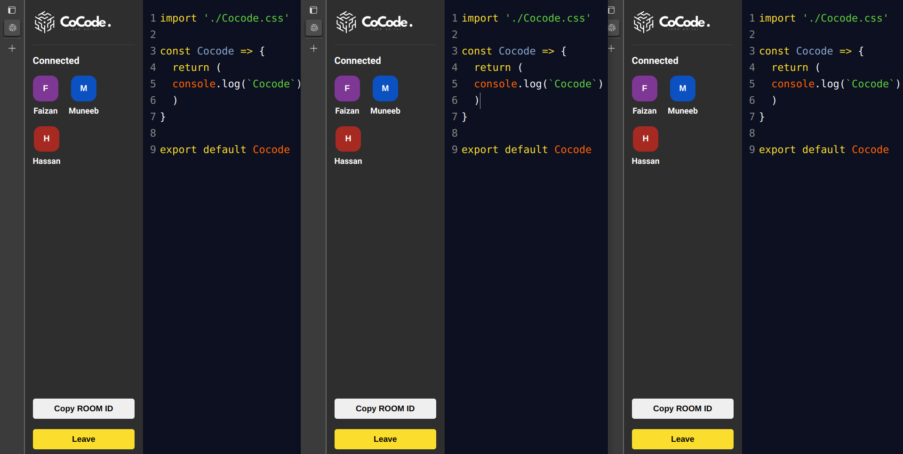

<p align='center'>
  
</p>

# Real-Time Code Editor with React, NodeJS, WebSockets, and MongoDB

This project demonstrates building a real-time code editor from scratch using React, NodeJS, and WebSockets. Users can collaborate on code in real-time within a shared room. Latest update includes local DB syncing for keeping codes across room id saved and accessible in future.

## Features
- Real-time collaborative code editing
- Unique room IDs for private editing sessions
- Toast notifications for user actions
- Clean and customizable editor design
- Server-side code synchronization
- Copy room ID for sharing
- User disconnect handling
- Auto-sync on first load
- Easy deployment
- NEW: Local DB for RoomID and Code History

## Technologies
- Frontend => React
- Backend => NodeJS
- Real-time Communication => WebSockets
- NEW: Local DB => MongoDB

## Getting Started
```bash
git clone https://github.com/hassan-arif/cocode.git
cd cocode
npm install # includes react-router-dom, uuid, react-hot-toast, react-avatar, codemirror, express, socket.io, socket.io-client, mongodb mongoose
npm start
```
Then open http://localhost:5000 in your browser.

## Usage
1. Create a new room or join an existing one using the room ID.
2. Start writing code in the editor.
3. Your changes will be synchronized with other users in real-time.
4. Use the toast notifications to see user actions.

## Screenshots
These screenshots demonstrate three instances of the application running in different browser windows, showcasing the real-time synchronization feature:

### Home Page
<p align='center'>localhost:5000/
  
</p>

### Editor Page
<p align='center'>localhost:5000/editor/549caef8-ab43-4552-8603-e2a269c59c33
  
  <br/>
  
</p>

As you can see, the code changes are instantly reflected across all users in real-time.

## Deployment
This project is currently not set up for production deployment. However, you can follow standard NodeJS deployment practices to get it up and running.

## Contributing
Contributions are welcome! Please fork the repository and create a pull request for any bug fixes or improvements.

Enjoy building and collaborating with this real-time code editor!
